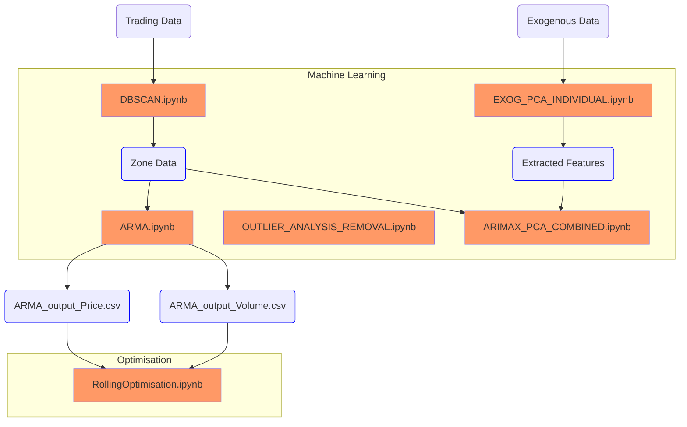

# Water Data Analysis

## Overview
This repository contains a comprehensive collection of Jupyter notebooks and Python scripts designed for in-depth analysis of water data. The primary focus is on time series forecasting, clustering techniques, and principal component analysis (PCA). These tools aim to uncover patterns, trends, and relationships within the water data, enabling better understanding and decision-making.

## Installation requirements
### Required Packages
To run the scripts and notebooks in this repository, you will need the following Python packages:

- `pandas`: For data manipulation and analysis.
- `numpy`: For numerical operations.
- `matplotlib`: For data visualization.
- `seaborn`: For statistical data visualization.
- `scikit-learn`: For machine learning algorithms, including DBSCAN.
- `statsmodels`: For statistical modeling, including ARMA.
- `requests`: For making HTTP requests to fetch data from APIs.
- `xml.etree.ElementTree`: For parsing XML data.
- `jupyter`: For running Jupyter notebooks.
- `keras`: For building and training deep learning models.
- `tensorflow`: For building and training deep learning models.

Scripts can be run using jupyter notebook.

## Input Data
### Downloaded Datasets
Downloaded datasets included in this file, primarily include the ALL_water_share_trading.csv, which is the dataset of all water trades in Australia, from the official water share register (https://waterregister.vic.gov.au/water-trading/water-share-trading)

Stock data is also included in the SP500_data, for later analysis

### Fetching Exogenous Data
So we fetch exogenous data via the GET_WATER_DATA_ONLINE scripts.

We use the Sensor Observation Service (SOS) to fetch the data. using the official Sensor Observation Service (SOS) API. (http://www.bom.gov.au/waterdata/wiski-web-public/Guide%20to%20Sensor%20Observation%20Services%20(SOS2)%20for%20Water%20Data%20%20Online%20v1.0.1.pdf)

There is a script in each folder, that fetches a specific parameter (rainfall, turbidity, water temoerature, ect) adn outputs it to a CSV file.

The main initial variables and parameters to set for each notebook are:
1. Coordinates of the bounding box for the area of interest. (SW_LAT, SW_LON, NE_LAT, NE_LON)

2. PARAMETER_NAME: The parameter name to fetch from the SOS (Pattern as described in the SOS documentation, followe by the timescale - monthly, daily data mean ect)

3. PROPERTY_NAME: The property name to fetch from the SOS (e.g rainfall, water temp , ect)

4. TIME_PERIOD: The time period to fetch from the SOS. (e.g. 2010/2024 that fetches data from 2010 to 2024)

5. OUTPUT_DOC: The output document name to fetch from the SOS. (e.g. MonthlyMeanRainfall)

The script then uses XML calls to fetch each station in the bounding box which has the required parameters, and then get the data from each station for that time period. Lasty, the data gets processed and pivoted so that stations are the columns, with the date being the rows before exporting to a CSV.

## Machine Learning Folder
### DBSCAN.ipynb
This notebook is used as a preliminary analysis to cluster the stations into groups, based on the price vs time relationship. It utilizes the DBSCAN clustering algorithm to identify clusters in the water trading data. The data is segmented by specific trading zones, and the clustering helps in understanding the patterns in water price fluctuations over time.

#### Key Steps in the Notebook:
- Data is first filtered and cleaned, focusing on specific trading zones and removing outliers.
- The `Create_date` is converted to a numerical format (`Create_date_ordinal`) to facilitate clustering.
- DBSCAN is applied to the dataset to identify clusters, with parameters `eps` and `min_samples` adjusted based on the data density.
- Results are visualized using matplotlib, showing clusters with different colors and noise points in black.
- The clustered data is then exported to CSV files for further analysis.

We seperate the three zones analysed and add cluster to the datasets before exporting to CSV: zone_data_1A_clustered, zone_data_6_clustered, zone_data_7_clustered.

### ARMA.ipynb
This section performs ARMA (AutoRegressive Moving Average) analysis for understanding and forecasting time series data related fro wateer share trading prices. 

#### Key Steps in the Notebook:
- The data is first loaded and preprocessed to ensure it is suitable for time series analysis.
- The model is fitted to the data, and diagnostics are run to check the adequacy of the model fit.
- Forecasts are generated from the model, and the results are visualized to assess the model's predictive power.

(In the Future, Stationarity tests will be conducted to check if the data needs differencing to make it stationary.)

#### Usage:
To perform ARMA analysis, load your time series data into the notebook, ensuring it is clean and appropriately indexed by date. Adjust the model parameters based on the characteristics of your data.

### EXOG_PCA_INDIVIDUAL.ipynb
This notebook is used to perform PCA analysis on the exogenous data to identify the principal components and understand the relationships between the variables.

#### Usage:
To perform PCA analysis, insert the file path of the time series data you want to analyze in the `file_path` column of the `data_files` list. Adjust the `row_thresh_multiplier` to control the amount of data to include in the analysis. (or the threshold to remove the data if it is missing)

### OUTLIER_ANALYSIS_REMOVAL.ipynb
This section uses multiple methods to remove and clean data. From trying k-means algorithms, to trying rolling mean to better clean and remove outliers.

#### Usage
Run the notebook, data will be visualised

### ARIMAX.ipynb
This notebook integrates exogenous variables into the time series analysis using ARIMAX models to improve forecasting accuracy. It combines principal component analysis (PCA) with SARIMAX modeling for enhanced prediction.

#### Key Steps
1. Load zone data and exogenous datasets (e.g., water temperature, rainfall, watercourse discharge).
2. Separate and sort the data based on cluster assignments and creation dates.
3. Align exogenous data with the main dataset by date and fill missing values.
4. Standardize the exogenous data using StandardScaler.
5. Perform PCA to reduce dimensionality and identify principal components.
6. Create a final DataFrame by joining PCA components with the target variable (Price Per ML ($)).
7. Align and resample exogenous data to daily frequency.
8. Split the data into training and testing sets.
9. Fit the SARIMAX model using the training data and specified parameters.
10. Generate forecasts for the test data.
11. Visualize the actual vs. forecasted prices, including confidence intervals.

### REGRESSION_LSTM.ipynb
This notebook attempts to perform linear regression and regression by deep neural networks on volume monthly weighted water allocation prices for their prediction based on monthly total traded water volumes to examine the possibility of creating a simple price prediction model without initially tending to use exogenous variables and feature engineering tools. Furthermore, the notebook attempts to perform time series analysis for future price prediction using an LSTM neural network. 

#### Key Steps
1.	Data is first processed, and monthly volume weighted water prices are calculated for each month of each representative year in the water market data.
2.	Lower and upper limitations are posed on the quality data obtained from the above step.
3.	The new dataset is then divided into training and testing datasets, scaled, and used for training a linear regression model for prediction.
4.	A deep neural network is then created with two Dense hidden layers for regression analysis to capture highly non-linear relationships between monthly total traded volume and monthly volume weighted water prices.
5.	An LSTM neural network is created with the aim of performing time series analysis for future price prediction using only monthly volume weighted water prices.
6.	Three datasets of exogenous variables, namely monthly mean temperature, monthly rainfall, and monthly mean water course discharge, are imported, cleaned, and merged with the volume-price data obtained in the second key step above.
#### Future Action
•	an LSTM model will be trained using more reliable data obtained from the use of feature engineering tools
•	A cross-validated grid search and Bayesian optimization will be performed for tuning the model’s hyperparameters
•	Different multi-arm bandit algorithms, such as epsilon-greedy, upper confidence bound, etc.,  will be employed to remove insignificant weights and reduce the network size.
•	A neural network integrated with Bayesian probability, also known as Bayesian neural network, will be employed to have more reliable price prediction model

#### Usage
The notebook puts a strong emphasis on the highly non-linear relationship between monthly total traded water volume and monthly volume weighted price by proving ineffectiveness of regression methods of machine learning and deep learning. The results clearly demonstrate a need for more reliable data sources for exogenous variables and feature engineering tools, including but not limited to KMeans and Principal Component Analysis. 

## Optimisation Folder
### RollingOptimisation.ipynb
This notebook uses the output of ARMA for the optimisation of volumes purchased in time that meet a target volume while minimising cost.
#### Key Steps
1. Implementation of a solution to the linear program formulation of the problem
2. Implementation of multiple approaches to dealing with the uncertainty of the data
3. Comparison of results
#### Future Action
Input and testing of results from other predictive models, e.g. ARIMAX and LSTM. This was not done due to these components of the project being develope simultaneously.
