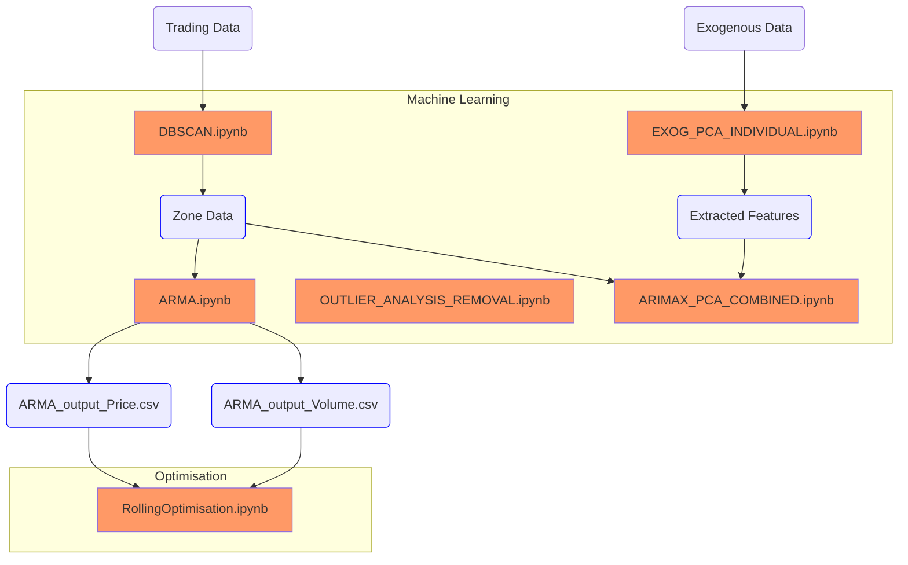

# Water Data Analysis

## Overview
This repository contains a comprehensive collection of Jupyter notebooks and Python scripts designed for in-depth analysis of water data. The primary focus is on time series forecasting, clustering techniques, and principal component analysis (PCA). These tools aim to uncover patterns, trends, and relationships within the water data, enabling better understanding and decision-making.

## Installation requirements
### Required Packages
To run the scripts and notebooks in this repository, you will need the following Python packages:

- `pandas`: For data manipulation and analysis.
- `numpy`: For numerical operations.
- `matplotlib`: For data visualization.
- `seaborn`: For statistical data visualization.
- `scikit-learn`: For machine learning algorithms, including DBSCAN.
- `statsmodels`: For statistical modeling, including ARMA.
- `requests`: For making HTTP requests to fetch data from APIs.
- `xml.etree.ElementTree`: For parsing XML data.
- `jupyter`: For running Jupyter notebooks.
- `keras`: For building and training deep learning models.
- `tensorflow`: For building and training deep learning models.

Scripts can be run using jupyter notebook.

## Input Data (data folder)
### Downloaded Datasets
Downloaded datasets included in this file, primarily include the ALL_water_share_trading.csv, which is the dataset of all water trades in Australia, from the official water share register (https://waterregister.vic.gov.au/water-trading/water-share-trading)

ASX200 data is also included in the data folder, for later analysis

### Fetching Exogenous Data
So we fetch exogenous data via the [A1] - GET_EXOG_VARS scripts.

We use the Sensor Observation Service (SOS) to fetch the data. using the official Sensor Observation Service (SOS) API. (http://www.bom.gov.au/waterdata/wiski-web-public/Guide%20to%20Sensor%20Observation%20Services%20(SOS2)%20for%20Water%20Data%20%20Online%20v1.0.1.pdf)

There is a script in each folder, that fetches a specific parameter (rainfall, turbidity, water temoerature, ect) adn outputs it to a CSV file.

The main initial variables and parameters to set for each notebook are:
1. Coordinates of the bounding box for the area of interest. (SW_LAT, SW_LON, NE_LAT, NE_LON)

2. PARAMETER_NAME: The parameter name to fetch from the SOS (Pattern as described in the SOS documentation, followe by the timescale - monthly, daily data mean ect)

3. PROPERTY_NAME: The property name to fetch from the SOS (e.g rainfall, water temp , ect)

4. TIME_PERIOD: The time period to fetch from the SOS. (e.g. 2010/2024 that fetches data from 2010 to 2024)

5. OUTPUT_DOC: The output document name to fetch from the SOS. (e.g. MonthlyMeanRainfall)

The script then uses XML calls to fetch each station in the bounding box which has the required parameters, and then get the data from each station for that time period. Lasty, the data gets processed and pivoted so that stations are the columns, with the date being the rows before exporting to a CSV.

## [3] Machine Learning Folder
### DBSCAN.ipynb ([3.1] - OUTLIER_REMOVAL)
This notebook is used as a preliminary analysis to cluster the stations into groups, based on the price vs time relationship. It utilizes the DBSCAN clustering algorithm to identify clusters in the water trading data. The data is segmented by specific trading zones, and the clustering helps in understanding the patterns in water price fluctuations over time.

#### Key Steps in the Notebook:
- Data is first filtered and cleaned, focusing on specific trading zones and removing outliers.
- The `Create_date` is converted to a numerical format (`Create_date_ordinal`) to facilitate clustering.
- DBSCAN is applied to the dataset to identify clusters, with parameters `eps` and `min_samples` adjusted based on the data density.
- Results are visualized using matplotlib, showing clusters with different colors and noise points in black.
- The clustered data is then exported to CSV files for further analysis.

We seperate the three zones analysed and add cluster to the datasets before exporting to CSV: zone_data_1A_clustered, zone_data_6_clustered, zone_data_7_clustered.

### ARMA.ipynb
This section performs ARMA (AutoRegressive Moving Average) analysis for understanding and forecasting time series data related fro wateer share trading prices. 

#### Key Steps in the Notebook:
- The data is first loaded and preprocessed to ensure it is suitable for time series analysis.
- The model is fitted to the data, and diagnostics are run to check the adequacy of the model fit.
- Forecasts are generated from the model, and the results are visualized to assess the model's predictive power.

(In the Future, Stationarity tests will be conducted to check if the data needs differencing to make it stationary.)

#### Usage:
To perform ARMA analysis, load your time series data into the notebook, ensuring it is clean and appropriately indexed by date. Adjust the model parameters based on the characteristics of your data.

### EXOG_PCA_INDIVIDUAL.ipynb ([3.2] - EXOG_PCA)
This notebook is used to perform PCA analysis on the exogenous data to identify the principal components and understand the relationships between the variables.

#### Usage:
To perform PCA analysis, insert the file path of the time series data you want to analyze in the `file_path` column of the `data_files` list. Adjust the `row_thresh_multiplier` to control the amount of data to include in the analysis. (or the threshold to remove the data if it is missing)

### OUTLIER_ANALYSIS_REMOVAL.ipynb
This section uses multiple methods to remove and clean data. From trying k-means algorithms, to trying rolling mean to better clean and remove outliers.

#### Usage
Run the notebook, data will be visualised

### Data Processing.ipynb
This notebook helps to obtain more reliable datasets from the raw water market data by inspecting, analysing, and utilizing its features. 
#### Key Steps
1.	Inspecting and analysing the features of the raw water market data
2.	Utilizing relevant non-numeric features of the data to obtain comparatively more reliable datasets

### Proven Non-Linearity.ipynb ([3.3-3.11] - NEURAL_NETWORKS Folder)
This notebook helps to capture non-linear relationships between total monthly traded volume and volume weighted average price datasets. 
#### Key Steps
1.	Creating a deep neural network with several Dense hidden layers to try to capture non-linear relationships between total monthly traded volume and volume weighted average price datasets
2.	Preparing a very small training dataset to intentionally promote over-fitting by the model
3.	Training the model with a training dataset using a batch size of 1
4.	Making predictions on both training and testing datasets

### Time Series Estimation via a Deep Neural Network.ipynb ([3.3-3.11] - NEURAL_NETWORKS Folder)
This notebook helps to make predictions for the water transaction price time series dataset using a DNN model.. 
#### Key Steps
1.	Creating a neural network with two Dense hidden layers for time series prediction of the water allocation price dataset
2.	Training the model with a training dataset
3.	Making predictions on both training and testing datasets

### Time Series Estimation via an LSTM Network.ipynb ([3.3-3.11] - NEURAL_NETWORKS Folder)
This notebook helps to make predictions for the water transaction price time series dataset using an LSTM model.. 

This notebook attempts to perform linear regression and regression by deep neural networks on volume monthly weighted water allocation prices for their prediction based on monthly total traded water volumes to examine the possibility of creating a simple price prediction model without initially tending to use exogenous variables and feature engineering tools. Furthermore, the notebook attempts to perform time series analysis for future price prediction using an LSTM neural network. 

#### Key Steps
1.	Creating a neural network with one LSTM layer and one Dense layer for time series prediction of the water allocation price dataset
2.	Training the model with a training dataset
3.	Making predictions on both training and testing datasets

### Time Series Estimation via a Bayesian Neural Network.ipynb
This notebook helps to make predictions for the water transaction price time series dataset using a Bayesian probabilistic model.. 
#### Key Steps
1.	Creating a neural network with Dense Variational layers to obtain probability distributions for weights and biases of the model
2.	Training the model with a training dataset
3.	Making predictions on both training and testing datasets
4.	Making additional predictions to observe uncertainty of the model

### Time Series Estimation with TensorFlow Structural Modelling.ipynb ([3.3-3.11] - NEURAL_NETWORKS Folder)
This notebook helps to make predictions for the water transaction price time series dataset using a structural time series model.
#### Key Steps
1.	Decomposing the water transaction data into its constituent parts
2.	Inspecting and analysing the patterns in the data
3.	Creating a structural time series model using the trends from the data decomposition
4.	Fitting the model and making predictions using a testing dataset

### Neural Network Pruning via a Multi-arm Bandit Approach.ipynb ([3.3-3.11] - NEURAL_NETWORKS Folder)
This notebook attempts to employ a multi-arm bandit approach to remove unnecessary weights from a trained deep neural network with two Dense hidden layers without compromising the performance of the model. 
#### Key Steps
1.	Creating a deep neural network with two Dense hidden layers
2.	Training the model with a training dataset
3.	Making predictions on both training and testing datasets
4.	Employing a multi-arm bandit algorithm (epsilon greedy) to remove unnecessary weights of the model
5.	Performing 10 percent pruning of the model
6.	Making predictions on both training and testing datasets using the model with new weights

### MOMENT_MONTHLY_PADDED.ipynb ([3.15] - MOMENT MODEL Folder)
This notebook utilizes the MOMENT model to analyze and forecast water transaction prices using monthly padded data. The data is padded to meet the minimum sequence length requirement of the model.

#### Key Steps
1. Load and preprocess the dataset to ensure it meets the input requirements of the MOMENT model.
2. Pad the data to achieve the required sequence length for the model.
3. Initialize and configure the MOMENT model for the forecasting task.
4. Train the model on the padded monthly data.
5. Evaluate the model's performance and visualize the forecasting results.
6. Analyze the model's output to gain insights into the data patterns and prediction accuracy.

#### Key Steps
1. Load zone data and exogenous datasets (e.g., water temperature, rainfall, watercourse discharge).
2. Separate and sort the data based on cluster assignments and creation dates.
3. Align exogenous data with the main dataset by date and fill missing values.
4. Standardize the exogenous data using StandardScaler.
5. Perform PCA to reduce dimensionality and identify principal components.
6. Create a final DataFrame by joining PCA components with the target variable (Price Per ML ($)).
7. Align and resample exogenous data to daily frequency.
8. Split the data into training and testing sets.
9. Fit the SARIMAX model using the training data and specified parameters.
10. Generate forecasts for the test data.
11. Visualize the actual vs. forecasted prices, including confidence intervals.

### ARIMAX.ipynb

## Optimisation Folder
### RollingOptimisation.ipynb
This notebook uses the output of ARMA for the optimisation of volumes purchased in time that meet a target volume while minimising cost.
#### Key Steps
1. Implementation of a solution to the linear program formulation of the problem
2. Implementation of multiple approaches to dealing with the uncertainty of the data
3. Comparison of results
#### Future Action
Input and testing of results from other predictive models, e.g. ARIMAX and LSTM. This was not done due to these components of the project being develope simultaneously.
